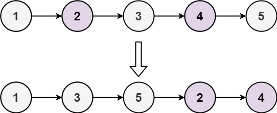

# 328. Odd Even Linked List
#LinkedList #leedcode 

## 題目描述
[LeetCode連結](https://leetcode.com/problems/odd-even-linked-list/description/?envType=study-plan-v2&envId=leetcode-75)

Given the `head` of a singly linked list, group all the nodes with odd indices together followed by the nodes with even indices, and return _the reordered list_.

The **first** node is considered **odd**, and the **second** node is **even**, and so on.

Note that the relative order inside both the even and odd groups should remain as it was in the input.

You must solve the problem in `O(1)` extra space complexity and `O(n)` time complexity.

`Example 1`


### 理解問題
**產出 / Output：**
將 Link List 重新排序，排序的邏輯是原為索引為奇數的項目排前面，偶數則後面。

**條件 / Constraint：**
- Do it in O(n) time complexity.
- UseO(1) extra space complexity.

## 解題思路

> 將`索引為奇數`及`索引為偶數`透過訪問每個在Link List值一次後，分別串在一起，最終把奇數串及偶數串連結起來回傳回去

### 解題步驟

**1. 定義 3 個 pointers**
- odd：最終的 odd
- even：最終的 even
- evenStart：紀錄 evenloop 開頭

**2.跑一次 Link List / Iterate Through the List**
- 串連 even 跟 odd 各自的 item

**3. 將 group even 跟 odd 連在一起**

**4. edge case**
- Link List 是空的或是只有一個
### 程式碼

```js
/**
* @param {ListNode} head
* @return {ListNode}
*/

var oddEvenList = function(head) {
  // edge case
  if (head === null || head.next === null) return head

  // define 定義 3 個 pointers
  var odd = head, even = head.next, evenStart = even

  while(even && even.next !== null) {
    // 串連 old indices and even indices
    // 紀錄每次當前old 及 even最終的點
    odd.next = even.next
    odd = odd.next

	even.next = old.next
	even = even.next
  }

  odd.next = evenStart
  return head
};

```